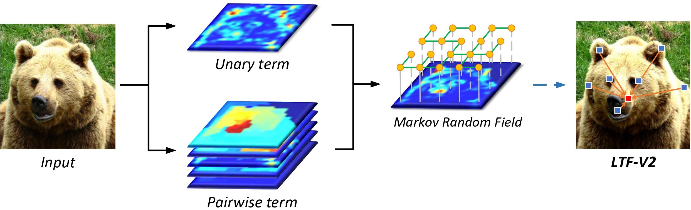

# Learnable Tree Filter V2
By Lin Song, Yanwei Li, Zhengkai Jiang, Zeming Li, Xiangyu Zhang, Hongbin Sun, Jian Sun, Nanning Zheng.

This repo is an official implementation for "[Rethinking Learnable Tree Filter for Generic Feature Transform](https://papers.nips.cc/paper/2020/file/2952351097998ac1240cb2ab7333a3d2-Paper.pdf)" (NeurIPS2020) on PyTorch framework. 



## Installation
### Requirements
- Python >= 3.6
- PyTorch >= 1.6 and torchvision
- OpenCV, needed by demo and visualization
- pycocotools: 
	- `pip install cython`
	- `pip install 'git+https://github.com/cocodataset/cocoapi.git#subdirectory=PythonAPI'`
- GCC >= 4.9

### Build from source
- `git clone https://github.com/StevenGrove/LearnableTreeFilterV2`
- `cd LearnableTreeFilterV2`
- `python setup.py build develop`
### Prepare data
See [datasets/README.md](datasets/README.md).

## Usage
All the projects are placed in  [cvpods_playground](cvpods_playground). You need to select a project and enter the corresponding folder.
```
# For example
cd cvpods_playground/mask_rcnn.res50.fpn.coco.1x.nn_syncbn.tf-v2
```

### Training
```
# Running training procedure with specific GPU number
cvpods_train --gpu-nums <GPU_NUM> [optional arguments]

# Please refer to tools/train_net.py for more optional arguments
```

### Inference
```
# Running inference procedure with specific GPU number
# The program will load the lastest model weights from ./log folder
cvpods_test --gpu-nums <GPU_NUM> [optional arguments]

# Running inference procedure with specific GPU number and model path
cvpods_test --gpu-nums <GPU_NUM> MODEL.WEIGHTS <model_path> [optional arguments]

# Please refer to tools/test_net.py for more optional arguments
```

### Visualize your image [Optional]
```
# Please refer to demo/demo.py for more optional arguments
python ../../demo/demo.py --config <config_path> --input <input_path> --output <output_path> MODEL.WEIGHTS <model_path> [optional arguments]
```

### Add  to your code [Optional]
```
# Load the learnable tree filter module
from cvpods.layers import TreeFilterV2

# Initialize the module with specific number of channels and groups
tf = TreeFilterV2(<guide_channels>, <in_channels>, <embed_channels>, [num_groups])

# Run the filter procedure with input feature and guided feature
output_feature = tf(<input_feature>, <guided_feature>)
```

## Performance

### Instance Segmentation on COCO *val* set
 Method | Backbone | Schedule | AP<sub>box</sub> (%) |  AP<sub>mask</sub> (%)  | Project | Model
:--|:--:|:--:|:--:|:--:|:--:|:--:
 Mask-RCNN+LTF-V2 | ResNet-50 | 1x | 41.3 | 37.0 | [Link](cvpods_playground/mask_rcnn.res50.fpn.coco.1x.nn_syncbn.tf-v2) | [GoogleDrive](https://drive.google.com/file/d/1797Ih_NAXHEsPpk9zvW2BHYlXbVx6Thm/view?usp=sharing)
 Mask-RCNN+LTF-V2 | ResNet-101 | 1x | 42.5 | 38.0 | [Link](cvpods_playground/mask_rcnn.res101.fpn.coco.1x.nn_syncbn.tf-v2) | [GoogleDrive](https://drive.google.com/file/d/11f1Oxt7N3ZcCnCFh8pwN70ZjxfJ_bfR4/view?usp=sharing)
 
### More Results is Coming


## To do
- [ ] Easier installation based on pip
- [ ] Experiments on panoptic segmentation
- [ ] Modify transformer
- [ ] Application on video tasks

## Citation

Please cite the paper in your publications if it helps your research.

```
@inproceedings{song2020rethinking,
    title = {Rethinking Learnable Tree Filter for Generic Feature Transform},
    author = {Song, Lin and Li, Yanwei and Jiang, Zhengkai and Li, Zeming and Zhang, Xiangyu and Sun, Hongbin and Sun, Jian and Zheng, Nanning},
    booktitle = {Advances in Neural Information Processing Systems},
    year = {2020}
}
```

Please cite this project in your publications if it helps your research.
```
@misc{learnabletreefilterv2,
    author = {Song, Lin},
    title = {LearnableTreeFilterV2},
    howpublished = {\url{https://github.com/StevenGrove/LearnableTreeFilterV2}},
    year ={2020}
}
```